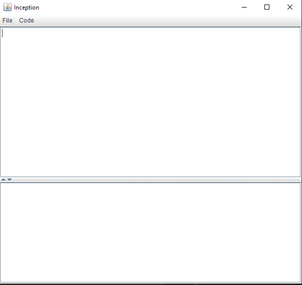
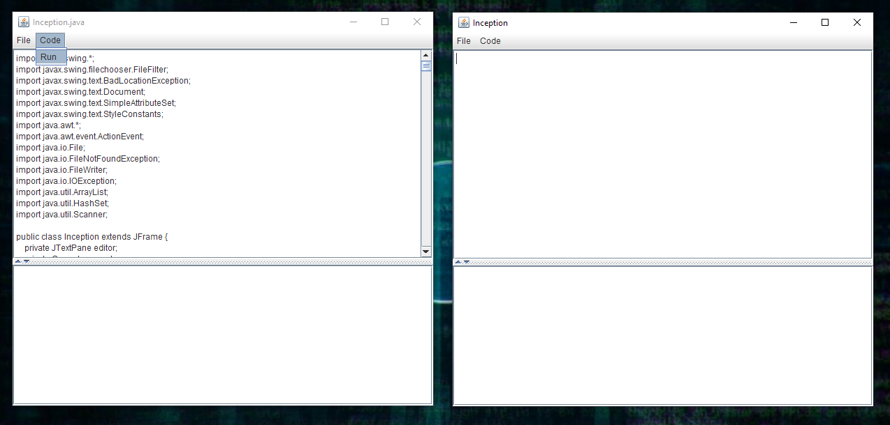
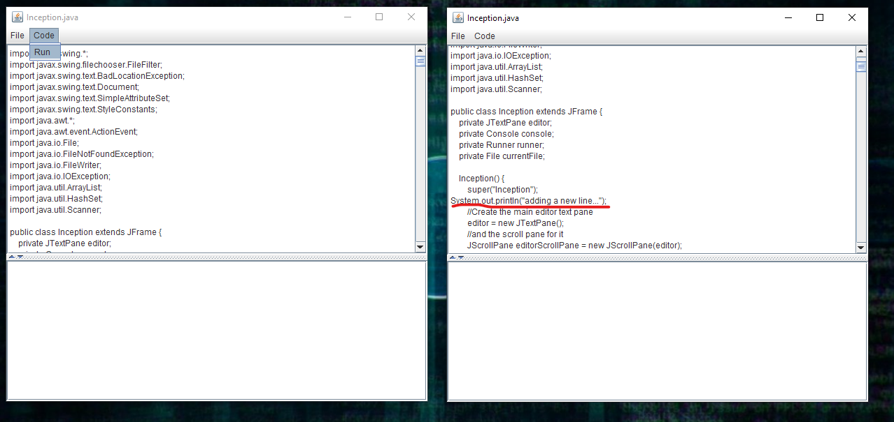
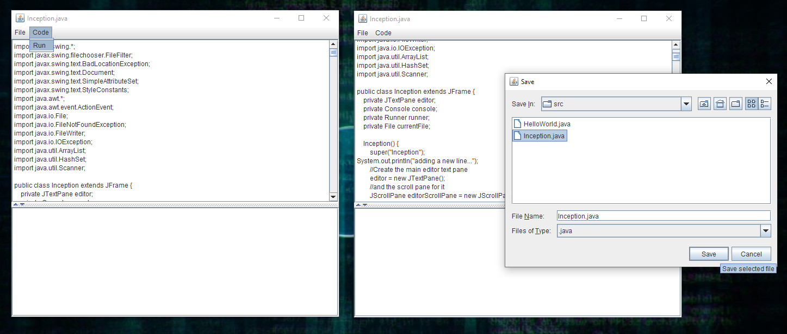
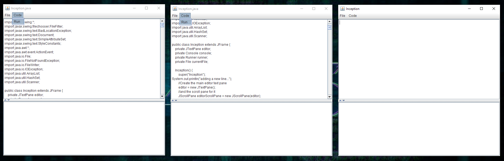
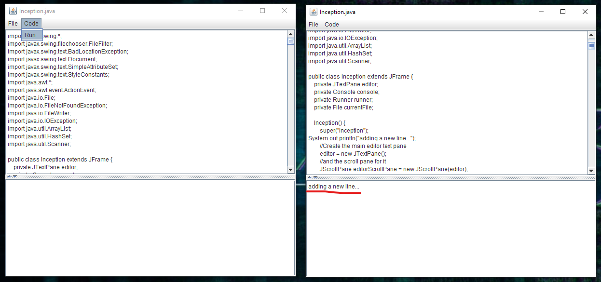

# inception 
#### an IDE written in an IDE

How much better can it get? (Well, actually, a lot...)

## Introduction
Hey, so I'll be honest I'm a little burnt out from this project because I've left it
to the very last few days. I promise, I've learnt my lesson. Anyhow, I'm still rather satisfied with how this turned out and I may very well
revisit this in the future. 

### What is this?
Well, this is my best attempt at creating my own IDE in Java for Java. (It really puts into perspective how 
smart the people at companies like JetBrains are.) Anyhow, I'm not really sure how
I come up with the idea, I just thought it would be kinda cool that instead of
writing code for you, I'd write code for you in which you could write your own code.

## Documentation
Hereafter comes documentation. I'll try to follow your layout, and also keep it brief
cause I really barely left my house today.

### Target grade: 3
Although, i'm not so sure anymore considering how sloppy some of the code is.

### Grading levels
#### Grade 1
##### Specification
- [x] There is a sensible description of what the program does.
- [x] The program reads input from the user and/or from a text data file and performs a meaningful operation.
- [x] Format of input is explained clearly.
- [x] The input contains multiple items of data (multiple numbers, or
  multiple lines of text, or similar).
- [ ] At least some of the data is read from the user or from a file
  using a loop (~while~, ~for~).
    - Note: There are /many/ ways to do this. Read multiple lines
      from a file. Repeat the same operation multiple times for the
      user. Read multiple lines from user input.
    - Ig not technically, no. 
##### Correctness and exception handling
- [x] The program ~~hopefully~~ works correctly in one documented test case with typical input. 
- [x] If any text data files are required to test this, they are supplied.

##### Code clarity
- [x] Code is indented correctly.
- [x] There is no unnecessary whitespace (no extra empty lines or extra spaces).
- [x] Identifiers (names of variables, constants and functions) are meaningful in the context of the program.

#### Grade 2
##### Correctness and exception handling
- [x] At least one exception is caught and reported correctly. This is also documented.

##### Code clarity
- [x] Constants are identified and named.
- [ ] All non-trivial parts of the code are commented. “Non-trivial” is defined by assuming that the reader is a fellow student.
    - I really didn't have time, I'm sorry. I tried more or less to.

#### Grade 3
##### Correctness and exception handling or wow-factor
- [ ] The correct working of the program has been documented in all possible special cases (except for the computer running out of memory). That is, your program will not throw an exception (unless your computer runs out of memory).
  - I tried to though, to the best of my abilities.
- [x] Your program does something considerably more complex and/or sophisticated that would be required. (In this case, it is much more difficult to document correct working in all special cases.)

##### Resource management
- [x] At least one resource is closed when no longer needed, even in the case of an exception. This is also documented.

##### Code clarity
- [x] The flow of the program is split into meaningful functions called by main().
- [ ] The role of defined functions is explained in comments.
  - some are, some aren't 😬
- [x] If useful, classes are defined for program-specific data types.

### Test Case
#### Simple example
1. Download the entire project from github as a .zip file.
2. Unzip into a directory, and open in Intellij IDEA (or any other IDE, unfortunately, mine doesn't support multiple files yet).
3. Configure the Intellij run configuration to Inception.java as the main class, if necessary.
4. Run the program: you should see a simple Notepad-like GUI appear.
5. Click *File -> Open...* and navigate to "test/HelloWorld.java"
6. You should see the text appear in the code editor, don't edit it yet.
7. Click *Code -> Run*: You should see "Hello world!" in the console log.
8. In the editor pane, change `System.out.println("Hello world!");` to `System.out.println("Jessie Pinkman");`
9. Click *File - Save As...* and overwrite "HelloWorld.java" 
10. Click *Code -> Run*: You should see "Jessie Pinkman" printed out in the console.

#### Inception
Have you watched the Inception? If so, the name of this program may hint at what this example contains.
1. Complete steps 1-4 from the previous example if you haven't already. If you are continuing from the previous example, there is no need to restart the program.
2. Click *File -> Open...* and navigate to "test/Inception.java"
3. Click *Code -> Run*: You should see... **(drumroll)** ...the exact same window of this IDE appear again 🤯🤯🤯
4. Feel free to open another IDE from the new IDE, edit the code, or mess around in any other way possible.

##### Bonus
Consider the following
1. Run Inception from Intellij normally

2. Then, run a new instance of Inception ("test/src/Inception.java") from Inception.

3. In that instance, modify the code of "test/src/Inception.java" 

4. Overwrite the code by saving the file

5. Click *Code -> Run*

6. You've now edited the code of the very instance of the IDE from the IDE itself.
7. Close the just opened instance of Inception.

### Exception handling
There is a lot to unpack here, and I'm sure a lot of it is nowhere near perfect.
- Unable to automatically find path to JDK: prompt manual user input.
- User does not enter valid JDK path: keep prompting.
- Error while automatically searching for the JDK path: keep silent to user, log to Intellij console, continue running.
- Opening file for reading fails: print to Inception console, continue running.
- Writing to file fails: print to Inception console, continue running.
- Running an empty/ghost file: print to Inception console, continue running.
- Unable to compile the file: print to Inception console, log to Intellij console, continue running.
- Unable to run compiled file: print to Inception console, log to Intellij console, continue running.
- .java file outside of a src file: prompt user to reposition file. 
- and of course a lot more possibilities which I probably haven't even considered.

### Resource management
All resources (I think) are opened, handled and disposed of properly. This includes
- FileWriter
- Scanner
- File
- JSwing Component
- Process

## Known problems
- **Exceptions that happen in the .java files ran by Intellij IDEA are not handled in any way - the code remains completely silent. This is just terrible, I know.** 
- nothing (in a bad way) happens when the .java file to run contains an input prompt (such as a Scanner)
- tab spacing in the editor doesn't match up with that of the file
- no support for multiple java files
- code runs synchronously, i.e. when a .java is being run, the IDE freezes
- only able to run .java files placed inside a /src/ folder
- rather bad code documentation and clarity
- some others I can't think of right now

    

