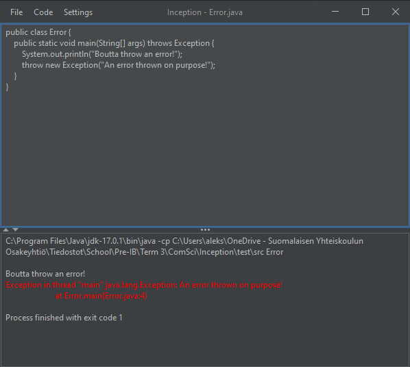

# inception 
An IDE written in an IDE to run an IDE. 
How much better can it get?

## Introduction

### What is this?
Inception is a semi-light-weight, semi-cross-platform JSwing application that incorporates the command-line
API in order to compile and execute .java files. In other words, it is a rather simple
and bare Java IDE that is nonetheless capable of fulfilling the basic tasks of managing
and executing Java files.

### Why is this?
This project was originally intended for my computer science course in school. At the time,
it was rather rough and incomplete. Since then however, I've spent a fair share of time 
tinkering with it out of enjoyment and will likely continue to do so in the future.

## Examples
One of my main aims was to make this IDE as intuitive as possible. In fact, my goal was
to make documentation not necessary in order to play around Inception. This would not only save the user time,
but would also liberate me from writing a Wikipedia page. I believe that the program fulfills that
criterion, yet, I'm still going to include a couple of interesting examples in this
documentation.

### Example 1 - Sum.java
This is a "getting started" example. It will deal with setting up
the program, opening a file and executing it. Refer to the *Behind the scenes* section if any
difficulties arise.

1. Clone or download this repository to your PC. 
   - Note: This project supports both Windows and 
   Linux operating systems.
2. Once installed, open this project in your IDE of choice. 
3. If necessary, adjust the running configuration to make Inception.java the main file.
4. Run the program. You will see a welcome message and a simple Notepad-like GUI.
5. From the *File* menu, select *Open* and navigate to `test/src/Sum.java`
6. You should notice the contents of the file appear in the editor panel.
7. Select *Code*, then *Run* to run the currently open file.
8. Now edit something in the editor pane. After, select *File* and *Save*.
9. Run the code again and observe the changes.

You are now familiar with the basics of using Inception. Feel free to explore other
menus in the bar and tinker with the layout, themes, code etc. The next example will
focus on the essence of this program.

### Example 2 - Inception.java
The name Inception was not coincidental for this project. In fact, I named this 
program after the famous movie starring Leonardo DiCaprio. The question that I sought
to answer from the very onset of this project was: What would happen if
I were to run an IDE from itself? The following example provides the answer.

1. Follow steps 1-4 from *Example 1* in order to open the IDE.
2. From the *File* menu, select *Open* and navigate to `test/src/Inception.java`
3. Run the code and observe an instance of Inception open from Inception itself. If desired,
go several layers deeper.
4. From the original instance, select *Code* then *Stop* to terminate the process chain.

## Behind the scenes
WIP

## Ideas & ToDo
- [x] asynchronous execution
- [x] universal tab spacing
  - [x] auto-deleting by tab-spacing
- [x] input and output into/from the process
- [ ] undo and redo actions
- [ ] code syntax highlighting
- [ ] custom project structure
  - [ ] multiple file support

    

